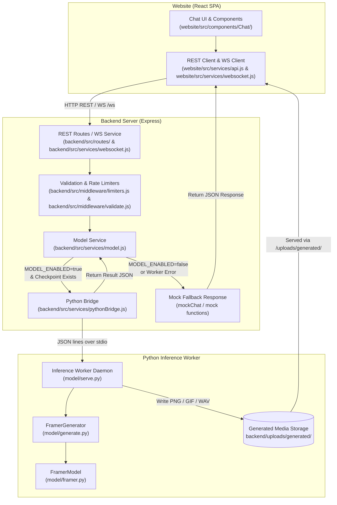
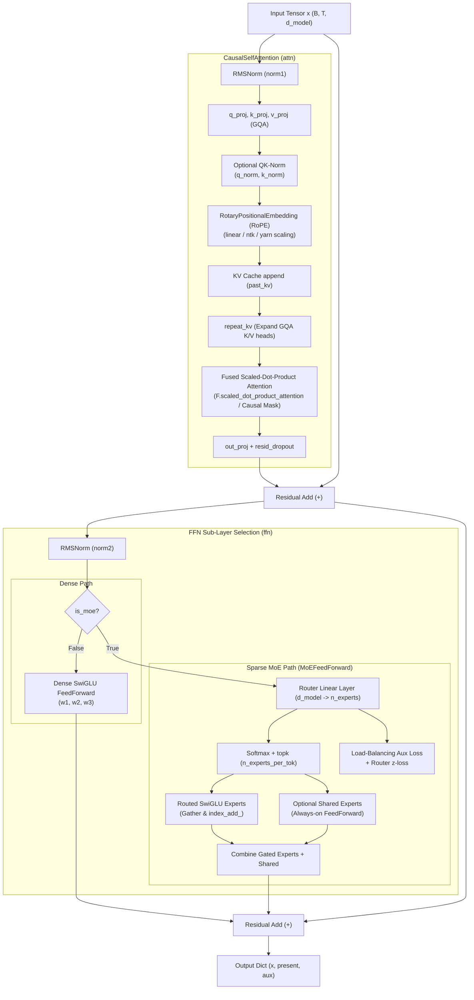
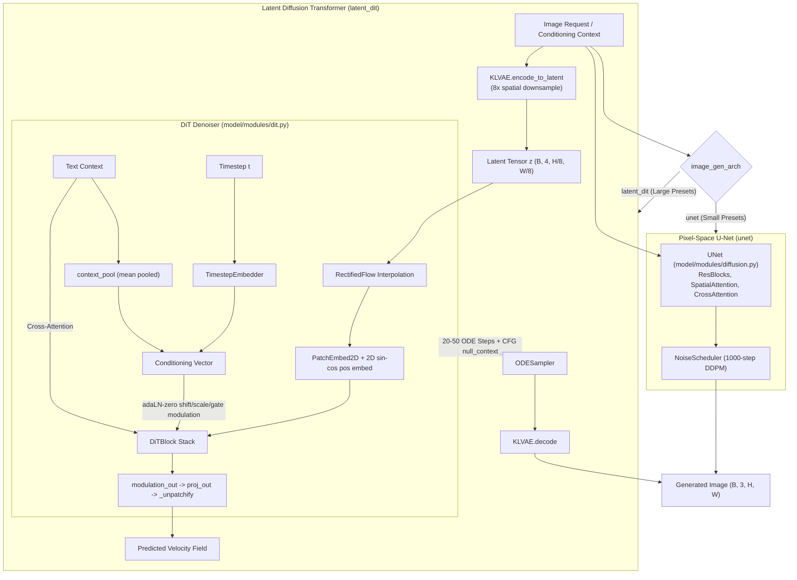
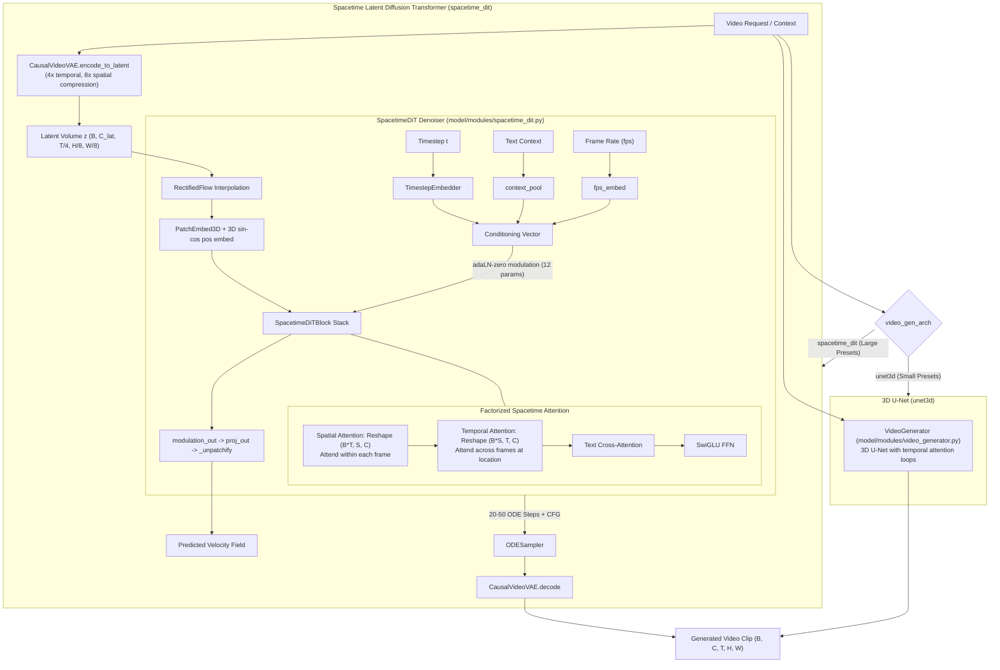
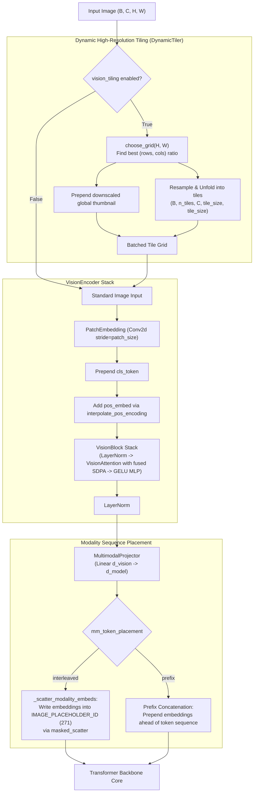

# FramerAI Guide

This guide is a hands-on walkthrough of the FramerAI codebase: how the pieces fit
together, how to run each part, and how to extend them. For a short overview read
the [README](README.md). For contribution mechanics read [CONTRIBUTING.md](CONTRIBUTING.md).

## Table of contents

- [System overview](#system-overview)
- [Repository layout](#repository-layout)
- [Prerequisites](#prerequisites)
- [End-to-end setup](#end-to-end-setup)
- [The model](#the-model)
- [Modalities](#modalities)
- [The training pipeline](#the-training-pipeline)
- [Reproducible training](#reproducible-training)
- [Training on your own data](#training-on-your-own-data)
- [Single-GPU training tutorial](#single-gpu-training-tutorial)
- [Cognition layer](#cognition-layer)
- [Tools](#tools)
- [The backend and the inference bridge](#the-backend-and-the-inference-bridge)
- [The website](#the-website)
- [Running with Docker](#running-with-docker)
- [Configuration and environment](#configuration-and-environment)
- [Common workflows](#common-workflows)
- [Troubleshooting](#troubleshooting)
- [Where to go next](#where-to-go-next)

## System overview

FramerAI is a single multimodal model served through a modular web and inference stack:



**Request Lifecycle Across Layers**:
1. **Website**: User input is sent via HTTP REST (`website/src/services/api.js`) or WebSocket frames (`website/src/services/websocket.js`).
2. **Backend**: Express validates payload boundaries (`backend/src/middleware/validate.js`) and enforces rate limits (`backend/src/middleware/limiters.js`). Route handlers pass requests to `backend/src/services/model.js`.
3. **Inference Bridge**: `backend/src/services/pythonBridge.js` manages a persistent sub-process running `python -m model.serve` over stdio JSON lines. If disabled (`MODEL_ENABLED=false`) or if no checkpoint exists, `backend/src/services/model.js` gracefully returns placeholder responses (`mockChat`).
4. **Python Worker**: `model/serve.py` uses `FramerGenerator` ([model/generate.py](model/generate.py)) and `FramerModel` ([model/framer.py](model/framer.py)) to run inference, writing output media to `backend/uploads/generated/`.


## Repository layout

| Path | Purpose |
|------|---------|
| `model/framer.py` | The unified `FramerModel` that ties the modules together. |
| `model/modules/` | Transformer, vision/audio encoders, and image/video/audio generators. |
| `model/tokenizer/` | Byte-level BPE tokenizer with multimodal special tokens. |
| `model/configs/` | Model size and hyperparameter configuration. |
| `model/data.py` | Local-corpus datasets (text, image-caption, audio-caption). |
| `model/generate.py` | Inference and sampling utilities. |
| `model/cognition/` | Optional persistent mind: memory, curiosity, affect, live senses, sleep. |
| `model/tools/` | Optional tools the model can call mid-turn: the protocol, the loop, internet access, and a sandboxed shell. |
| `model/serve.py` | Inference worker driven by the backend over stdin/stdout. |
| `build.py` | Command line entry point to build, train, and export models. |
| `train.sh` | Convenience wrapper around the full pipeline. |
| `backend/src/` | Express server, routes, services, and the Python bridge. |
| `website/src/` | React components, hooks, services, and styles. |
| `data/` | Your local training data. |
| `Dockerfile`, `docker-compose.yml` | Container build for the model and stack. |

## Prerequisites

- Python 3.10 or newer.
- Node.js 18 or newer and npm.
- A CUDA-capable GPU is recommended for training. CPU works for small models and inference but is slow.
- Audio file support: `soundfile` is installed by `requirements.txt`. `torchaudio` is an optional fallback loader listed under the optional extras and must be installed separately.

## End-to-end setup

```bash
git clone https://github.com/Spyxpo/framerai.git
cd framerai
```

### 1. Model environment

```bash
python -m venv venv
source venv/bin/activate
pip install -r requirements.txt
python build.py --mode all --size tiny
```

### 2. Backend

```bash
cd backend
npm install
cp .env.example .env
npm run dev
```

The API server listens on `http://localhost:3001`.

### 3. Website

```bash
cd website
npm install
npm run dev
```

The web app opens at `http://localhost:5173`.

## The model

`FramerModel` in `model/framer.py` composes several modules:

- Transformer backbone: an autoregressive decoder using RoPE, SwiGLU, and RMSNorm.
- Vision encoder: a ViT-style encoder that turns images into patch embeddings.
- Audio encoder: a mel-spectrogram front-end and transformer that turns audio into embeddings.
- Image decoder: a KL-VAE plus a diffusion transformer on a rectified-flow objective, or the
  original pixel-space U-Net, selected by `image_gen_arch`.
- Video decoder: a causal 3D VAE plus a spacetime diffusion transformer, or the original 3D
  U-Net, selected by `video_gen_arch`.
- Audio decoder: an RVQ codec producing discrete acoustic tokens plus a neural vocoder, or the
  original mel diffusion, selected by `audio_gen_arch`.
- Multimodal projector: aligns vision and audio embeddings with the language model space.

Model sizes are named presets in `model/configs/presets.py` (run
`python build.py --list-presets` to print them). Text is the transformer backbone,
multimodal is the encoders plus the diffusion decoders, and model total is the whole thing:

| Preset | d_model | Layers | Heads (Q/KV) | Text | Active | Multimodal | Model total |
|--------|---------|--------|--------------|------|--------|------------|-------------|
| `framer-tiny` | 256 | 6 | 8 / 4 | ~19M | ~19M | ~20M | ~39M |
| `framer-small` | 768 | 12 | 12 / 4 | ~142M | ~142M | ~94M | ~236M |
| `framer-medium` | 1024 | 24 | 16 / 8 | ~429M | ~429M | ~512M | ~941M |
| `framer-large` | 2048 | 24 | 16 / 8 | ~1.2B | ~1.2B | ~2.5B | ~3.7B |
| `framer-3b` | 2560 | 32 | 20 / 4 | ~2.3B | ~2.3B | ~1.01B | ~3.34B |
| `framer-8b` | 4096 | 32 | 32 / 8 | ~7.2B | ~7.2B | ~2.10B | ~9.28B |
| `framer-30b-a3b` | 2048 | 28 | 16 / 4 | ~34B | ~3.0B | ~983M | ~34.56B |
| `framer-160b-a16b` | 4096 | 48 | 32 / 8 | ~152B | ~15B | ~5.4B | ~157B |
| `framer-200b-a20b` | 5120 | 48 | 40 / 8 | ~193B | ~20B | ~11.5B | ~205B |
| `framer-1t-a32b` | 8192 | 64 | 64 / 8 | ~983B | ~32B | ~21.1B | ~1.00T |
| `framer-2t-a49b` | 10240 | 84 | 80 / 8 | ~1.96T | ~49B | ~39.3B | ~2.00T |
| `framer-3t-a64b` | 10240 | 84 | 80 / 8 | ~2.93T | ~64B | ~76.7B | ~3.01T |

Dense presets train on a single consumer GPU or CPU; the MoE presets (`*-a*b`)
scale total parameters via sparse experts and need multi-node hardware to train.
The five largest scale their vision, audio, and diffusion towers with the backbone, so
`framer-3t-a64b` holds three trillion parameters across all five modalities rather than in the
language model alone, and carries a 1,048,576-token context reached with YaRN RoPE scaling
from the 16384 the backbone pretrains at. `--size tiny|small|medium|large` remains as a legacy alias, and
`--preset NAME` selects any preset by name (also available on `train.sh`).

### Transformer backbone and MoE

The core language and code processing engine is implemented in [model/modules/transformer.py](model/modules/transformer.py) (`TransformerBlock`) and [model/modules/moe.py](model/modules/moe.py) (`MoEFeedForward`):



**Transformer & MoE Key Details**:
- **Pre-Normalization**: Each block applies `RMSNorm` before attention and FFN sub-layers.
- **Grouped-Query Attention (GQA)**: Query projection (`q_proj`) expands to `n_heads`, while key/value projections (`k_proj`, `v_proj`) expand to `n_kv_heads`. `repeat_kv` repeats key/value heads prior to attention calculation.
- **Rotary Position Embeddings (RoPE)**: Applied via `RotaryPositionalEmbedding` with support for `linear` position interpolation, `ntk` base scaling, and `yarn` (NTK-by-parts interpolation with attention factor scaling `0.1 * ln(s) + 1`).
- **Attention Execution & KV Cache**: Utilizes `F.scaled_dot_product_attention` for fast execution; when caching is enabled (`use_cache=True`), incoming query positions are rotated relative to past KV offsets.
- **MoE Routing**: `build_ffn` constructs `MoEFeedForward` for MoE layers. The router scores all experts, selects top-k (`n_experts_per_tok`), computes token dispatch, and accumulates outputs alongside optional always-on shared experts. Auxiliary load-balancing and router z-loss are aggregated across layers.


### Why fine-grained experts

`framer-2t-a49b` uses 384 experts of width 2048 rather than, say, 192 of width 4096, and
`framer-3t-a64b` uses 512 of width 2304. Total parameters scale with the expert *count*,
active parameters with `n_experts_per_tok`, so narrower and more numerous experts buy
sparsity at the same total. Both counts divide evenly across 8, 16, 32, 64, and 128-way
expert-parallel meshes - 384 is 3 x 128, 512 is 4 x 128 - a placement constraint worth
respecting before the sharding code exists rather than after.

The 3T preset also routes top-6 rather than top-4. It is the one change that raises
per-token compute, from 63.98B active against 49.40B, and it is spent on the width of the
path each token takes rather than on more total parameters.

Attention is roughly 39% of the flagship's active budget (84 layers x 230.7M). That is a
consequence of `d_model=10240` with only four routed experts per token, and it is the knob to
turn if more of the active budget should sit in the FFN.

### How the estimator sizes a trillion parameters on a laptop

`estimate_params(config)` in `model/utils/helpers.py` never builds the model. The text
backbone is computed analytically from the config (attention, SwiGLU or MoE experts,
embeddings, norms), and each multimodal tower is constructed under `torch.device("meta")`,
which materializes shapes without storage. That keeps the number honest — it tracks the real
module code rather than a formula that can drift from it — while staying instant and
allocation-free. `python build.py --preset NAME --estimate` prints the per-tower breakdown
plus the bf16 weight footprint and the full AdamW training state.

The tower list itself lives in one place, `MULTIMODAL_TOWERS` in `model/utils/helpers.py`,
which the estimator, `build.py`'s breakdown, and the tests all import. `estimate_params` and
`estimate_multimodal_params` take `strict=True` to re-raise instead of degrading to
"could not be sized"; the tests use it so a tower that resists meta construction fails loudly
rather than silently shrinking the reported model.

### Choosing an architecture per modality

Each decoder family is selected by a config field that defaults to the original implementation,
so the laptop-scale presets keep their existing path byte for byte and only the large presets
opt in. The estimator meta-constructs whatever the config selects, so `--estimate` stays exact
across the switch.

| Field | Default | Alternative | Set by |
|---|---|---|---|
| `image_gen_arch` | `unet` | `latent_dit` | the four large MoE presets |
| `video_gen_arch` | `unet3d` | `spacetime_dit` | the four large MoE presets |
| `audio_gen_arch` | `mel_diffusion` | `rvq_lm` | the four large MoE presets |
| `vocoder_arch` | `griffin_lim` | `istft` | the four large MoE presets |
| `mm_token_placement` | `prefix` | `interleaved` | `framer-1t-a32b`, `framer-2t-a49b`, `framer-3t-a64b` |
| `vision_tiling` | `False` | `True` | `framer-1t-a32b`, `framer-2t-a49b`, `framer-3t-a64b` |

`unet` is the pixel-space U-Net. Its attention is quadratic in pixel count, which is why it
cannot run at the resolutions the large presets configure. `latent_dit` is a KL-VAE that
compresses 8x in each spatial dimension plus a diffusion transformer over the resulting latent
grid, so a 512x512 image is denoised as a 64x64 latent - 64x fewer positions to attend over.

The latent path brings three things the U-Net did not have:

- **adaLN-zero conditioning.** Timestep and pooled text modulate every block through a
  zero-initialized projection, so each block starts as the identity and the residual stream is
  undisturbed at step zero. This is what makes a deep denoiser trainable from scratch.
- **Rectified flow.** The model predicts a straight-line velocity between noise and data
  rather than the noise itself, which makes the sampling trajectory nearly straight and
  solvable in 20-50 ODE steps instead of a 1000-step ancestral chain.
- **Classifier-free guidance.** `cfg_dropout_prob` replaces whole examples' conditioning with a
  learned `null_context` embedding during training; at inference the conditional and
  unconditional fields are evaluated in one batch-doubled forward and extrapolated apart by
  `cfg_scale`. The README advertised this from the beginning and no such code existed until now.

Positions in the transformer come from an on-the-fly 2D sin-cos grid rather than a learned
table, so one set of weights denoises any resolution and aspect ratio the VAE can produce.

#### Image diffusion module (`image_gen_arch`)

Built via `build_image_generator(config)` in [model/modules/latent_diffusion.py](model/modules/latent_diffusion.py):



**Image Diffusion Overview**:
- **`latent_dit`**: Encodes images to an 8x downsampled latent space via `KLVAE` ([model/modules/vae.py](model/modules/vae.py)). Denoising is performed by `DiT` ([model/modules/dit.py](model/modules/dit.py)) using `DiTBlock` layers modulated by adaLN-zero shift/scale/gate parameters. Trains on `RectifiedFlow` ([model/modules/flow.py](model/modules/flow.py)) velocity prediction and samples via `ODESampler` in 20-50 steps with Classifier-Free Guidance (`null_context`).
- **`unet`**: Pixel-space `UNet` ([model/modules/diffusion.py](model/modules/diffusion.py)) utilizing 1000-step DDPM ancestral sampling.

#### Video diffusion module (`video_gen_arch`)

Built via `build_video_generator(config)` in [model/modules/latent_video.py](model/modules/latent_video.py):



**Video Diffusion Overview**:
- **`spacetime_dit`**: Compresses clips using `CausalVideoVAE` ([model/modules/video_vae.py](model/modules/video_vae.py)) with 4x temporal and 8x spatial downsampling. `SpacetimeDiT` ([model/modules/spacetime_dit.py](model/modules/spacetime_dit.py)) conditions on timestep, text context, and FPS, factorizing attention into spatial (`B*T, S, C`) and temporal (`B*S, T, C`) passes to eliminate quadratic 3D attention complexity.
- **`unet3d`**: Legacy pixel-space 3D U-Net ([model/modules/video_generator.py](model/modules/video_generator.py)) running explicit temporal loops.

### Evaluating a checkpoint

`model/eval/` provides one suite per modality behind a small harness:

```python
from model.eval import default_harness

report = default_harness(model).run(inputs={
    "text": {"batches": [(input_ids, labels)]},
    "image": {"real": real_images, "fake": generated, "captions": caption_ids},
    "video": {"real": real_clips, "fake": generated_clips},
    "audio": {"reference": waveform, "estimate": reconstructed},
})
print(report.summary())
```

A suite that cannot run is recorded as skipped **with its reason**, not omitted. A missing
input is not the same as a good score, and a harness that conflates them is worse than no
harness.

Two caveats worth stating before the numbers are used:

- **Frechet distance uses the model's own encoders**, not Inception or I3D. The scores are
  therefore comparable across FramerAI checkpoints and meaningless against published FID or FVD
  figures.
- **A low Frechet distance with poor alignment** means the model makes plausible images of the
  wrong thing. `alignment_score` is what measures prompt adherence, and the two should be read
  together.

`bits_per_byte` is tokenizer-independent, so two models with different vocabularies can be
compared on the same corpus - which raw perplexity cannot do.

#### Running standard benchmarks

The evaluation harness supports standard text and code benchmarks through `build.py --mode eval`:

```bash
# Run all benchmarks
python build.py --mode eval --size tiny --benchmark-dir benchmarks

# Save results to JSON
python build.py --mode eval --size tiny --benchmark-dir benchmarks --eval-output results.json

# Run a subset of HumanEval for quick smoke tests
python build.py --mode eval --size tiny --eval-code-limit 10
```

**Benchmark data structure:**

```
benchmarks/
├── wikitext-2/
│   └── test.txt         # Plain text corpus for perplexity and token accuracy
└── humaneval/
    └── HumanEval.jsonl  # Code problems with prompts and unit tests
```

Benchmarks are **not downloaded automatically**. Missing benchmark data is reported as skipped
with a clear message rather than producing fake results.

**Reproducibility:** Evaluation runs with a fixed seed (default 42), deterministic batch
construction, and explicit benchmark ordering. The same checkpoint and data will produce the
same scores across runs.

**Code evaluation security:** Generated code is executed in a separate Python subprocess with
a timeout. This isolates execution from the main process but does not provide sandboxing
against filesystem access or network calls. Do not run untrusted benchmarks on systems with
sensitive data.

**Results:**

| Benchmark | Metric | framer-tiny | framer-small | framer-medium | framer-large |
|-----------|--------|-------------|--------------|---------------|--------------|
| WikiText-2 | Perplexity | *not yet measured* | *not yet measured* | *not yet measured* | *not yet measured* |
| WikiText-2 | Token Accuracy | *not yet measured* | *not yet measured* | *not yet measured* | *not yet measured* |
| HumanEval | pass@1 | *not yet measured* | *not yet measured* | *not yet measured* | *not yet measured* |

Real benchmark scores require a trained checkpoint on a sufficiently large corpus. The table
above will be populated as checkpoints become available.

### Placing modalities in the sequence

Under `prefix`, encoded image and audio embeddings are concatenated ahead of the tokens. That
costs extra sequence positions and, more importantly, discards *where* each modality appeared:
"how does the first image differ from the second" is unanswerable from a prefix.

Under `interleaved`, the sequence reserves one placeholder token per embedding and
`_scatter_modality_embeds` writes them in with `masked_scatter`. Length, attention mask, and
label alignment are all unchanged, because this replaces rather than inserts.

The two halves of the contract are `InterleavedSequenceBuilder` in `model/data.py`, which emits
` <img_patch> x N <img_end>` runs, and the encoder, which produces N embeddings. A count
mismatch raises rather than corrupting the sequence silently.

### High-resolution tiling

With `vision_tiling` on, `image_size` becomes the *tile* size and `DynamicTiler` splits an image
into the `(rows, cols)` grid whose aspect ratio best matches it, bounded by `vision_max_tiles`.
Attention is quadratic within a tile but only linear across tiles, so 12 tiles cover roughly
3.5x the linear resolution at a fraction of what one large forward would cost. A downscaled
thumbnail is prepended because tiles alone destroy global layout.

`PatchEmbedding.interpolate_pos_encoding` bicubically resamples the learned position table when
the patch grid differs from the trained one, so the same weights accept a tile of any shape.

`ContrastiveVisionTrainer` in `model/training/contrastive.py` gives the vision tower a training
signal of its own: symmetric InfoNCE between pooled image and text embeddings with a learned
temperature. Without it the encoder learns only from whatever gradient reaches it through the
language-model loss, which is weak and indirect.

#### Vision encoder architecture and modality placement

Implemented in [model/modules/vision_encoder.py](model/modules/vision_encoder.py) (`VisionEncoder`, `DynamicTiler`) and [model/framer.py](model/framer.py) (`encode_image_tiles`, `_scatter_modality_embeds`):



**Vision Encoder Details**:
- **Dynamic Tiling**: `DynamicTiler` dynamically selects a grid `(rows, cols)` matching the image aspect ratio up to `vision_max_tiles`. A global downscaled thumbnail tile is prepended to preserve macro layout.
- **Patch Embedding**: `PatchEmbedding` computes conv projections and prepends a `cls_token`. `interpolate_pos_encoding` uses 2D bicubic interpolation to dynamically adjust position embeddings to non-standard tile shapes.
- **Encoder Blocks**: `VisionEncoder` runs a series of `VisionBlock` layers with `VisionAttention` (fused SDPA) and GELU MLPs.
- **Sequence Placement**: Encoded vision tokens pass through `MultimodalProjector`. Under `mm_token_placement="interleaved"`, tokens overwrite reserved `IMAGE_PLACEHOLDER_ID` (271) positions in-place, maintaining text-image alignment. Under `"prefix"`, embeddings concatenate at sequence start.

### Requesting a size

`resolve_image_request` in `model/utils/image_request.py` turns a request into concrete
dimensions. Precedence is explicit over implicit, always:

| Source | Wins over | Example |
|---|---|---|
| `width` + `height` | everything | `{"width": 1024, "height": 768}` |
| `aspect` + `tier` | prompt and default | `{"aspect": "16:9", "tier": 1024}` |
| prompt intent | default | `"a widescreen shot of a valley"` |
| config default | - | `image_default_aspect`, `image_size_tier` |

Because an explicit parameter short-circuits parsing entirely, a sizing word in the prompt can
never quietly override what the caller asked for. The resolved `ImageRequest` carries `source`,
so a caller can distinguish an instruction from a guess, and `snapped`, so an off-bucket
request is visibly adjusted rather than silently changed.

Prompt parsing recognises explicit sizes (`1024x1024`, `1024 by 768`), ratios (`16:9`), named
shapes (`widescreen`, `portrait`, `phone wallpaper`, `ultrawide`, `banner`), and tier words
(`hd`, `4k`). Set `image_allow_custom_size=False` to turn it off and honour only explicit
parameters.

A recognised phrase is stripped from the conditioning text only when it reads as an
instruction. `_SUBJECT_WORDS` lists the shape words that are just as likely to be describing
the subject: "a portrait of a woman" still resolves to 2:3, because the guess is a good one,
but the prompt is left intact, since removing the word would leave "a of a woman". "a woman in
portrait orientation" is a directive and is stripped.

Buckets are generated, not listed: for tier area `A` and ratio `r`, the size is
`round16(sqrt(A * r))` by `round16(sqrt(A / r))`. Every ratio therefore costs about the same
compute, and both dimensions divide `vae_downsample * dit_patch_size`, which is what the DiT
patch embedding requires.

Arbitrary ratios need `image_gen_arch="latent_dit"`. Under `unet` a non-square request raises a
message naming the setting, rather than producing something misshapen.

### Distributing the experts

`framer-2t-a49b` has 384 experts per layer across 80 MoE layers. Every rank holding every
expert is what makes the model 3.6 TiB per host; expert parallelism gives each rank
`n_experts // ep_world` of them, so expert weights divide by the mesh size while the router and
attention stay replicated.

```python
from model.training import build_device_mesh, plan_from_environment, shard_model_experts

mesh = build_device_mesh(ep_size=8)
model = FramerModel.from_config_meta(config)
shard_model_experts(model, plan_from_environment(ep_size=8, group=mesh["ep"].get_group()))
model.to_empty(device="cuda")
model.init_weights_(buffer_device="cuda")
model = maybe_wrap_fsdp(model, config, device, mesh=mesh)
```

Order matters: sharding happens on the meta module, *before* materialization, so the experts a
rank will never hold are never allocated in the first place.

The `(dp, ep)` mesh is what keeps FSDP and expert parallelism composable. FSDP shards over
`dp`; expert weights are already split over `ep`, and sharding them again would divide them
twice and leave each rank with a fragment of a fragment.

Routing is unchanged — `n_experts` stays global and the router still scores all of them. What
changes is where the expert lives, so a token routed off-rank is sent there, computed, and sent
back, which is the all-to-all dispatch and combine.

384 is `3 x 128` precisely so this divides evenly across 8, 16, 32, 64, and 128-way meshes, and
a test asserts that for every one of them.

### Constructing a model too large for one host

`build.py` allocates the whole model on one device, which works up to a few billion
parameters and not beyond. `framer-2t-a49b` needs roughly 7.4 TiB in fp32 to instantiate, so
`--mode build` refuses it up front and points at `--estimate` rather than being OOM-killed.
Pass `--force` to override.

To actually materialise a model at that scale, build its shapes first and fill them in
per-rank afterwards:

```python
model = FramerModel.from_config_meta(config)   # shapes only, allocates nothing
# ... apply FSDP / expert-parallel sharding to the meta module ...
model.to_empty(device="cuda")                  # storage, no contents
model.init_weights_(buffer_device="cuda")      # parameters and derived buffers
```

`to_empty()` allocates without initialising, so `init_weights_` has to fill everything:
parameters get their distribution, and every module owning a *derived* buffer (RoPE inverse
frequencies, diffusion noise schedules, mel filterbanks) recomputes it through
`reset_buffers`. Modules with hand-rolled parameters that torch cannot initialise generically
(`RMSNorm`, the patch and frame position embeddings) implement `reset_parameters`.

Checkpoints go through `model/training/checkpoint.py`. `save_sharded` writes one file per
rank into a directory and `load_sharded` reassembles them, resharding if the world size
changed. `gather_full_state_dict` collects the complete tensors on rank 0 for a portable
single-file export, which is only possible when the model fits on one host. Under FSDP2 each
rank holds a slice of every parameter, so the old single-file save was persisting one rank's
shard under a name that claimed to be the whole model.

`FramerConfig.validate()` runs whenever a preset is built and after CLI overrides are applied.
It checks the invariants the modules assume: head divisibility for attention and GQA, patch
size dividing image size, MoE routing width, and the `GroupNorm(32)` channel granularity that
the image and video U-Nets require (which makes 64 the real step for `diffusion_channels`,
since the video U-Net runs at half width).

To experiment with a custom shape, pass overrides:

```bash
python build.py --mode build --d-model 512 --n-layers 12 --n-heads 8
```

## Modalities

Modality routing is implicit. In `FramerModel.forward`, an argument being present
selects the path:

- `images` / `audio` (inputs) are encoded and prepended to the token sequence.
- `input_ids` runs the transformer and, with `labels`, computes the text loss.
- `target_images` / `target_video` / `target_audio` (outputs) run the matching
  text-conditioned diffusion decoder and add a loss.

At inference time, `FramerGenerator` (`model/generate.py`) exposes explicit
methods: `generate_text` (optionally conditioned on an image or audio),
`generate_image`, `generate_video`, `generate_audio`, `generate_code`, and
`transcribe` (audio to text).

The tokenizer adds `<audio>` and `<audio_end>` alongside the existing image,
video, and code special tokens.

## The training pipeline

`build.py` is the single entry point with four modes:

| Mode | Action |
|------|--------|
| `build` | Initialize weights and train the tokenizer. |
| `train` | Train from scratch on the local corpus. |
| `export` | Export the model for serving. |
| `all` | Run build, train, and export in sequence. |

Example:

```bash
python build.py --mode all --size tiny --data-dir data --max-steps 10000
```

`train.sh` wraps install, build/train/export, and serving. Run `./train.sh --help`
for options.

## Reproducible training

Every training run is reproducible when you fix the preset, the seed, and the
data. Pass `--seed` to override the default (42); the seed is applied before
model initialization so weight init and data shuffling are both covered.

`model/configs/training_configs.py` provides a ready-to-use configuration for
each of the four main presets. The table below lists all training values.
All fields map directly to `FramerConfig` and are surfaced as CLI flags on
`build.py`.

| Preset | Seed | Batch | Grad accum | Eff. batch | LR | Warmup | Max steps | Precision | Grad ckpt | Hardware |
|--------|------|-------|------------|------------|------|--------|-----------|-----------|-----------|----------|
| `framer-tiny` | 42 | 8 | 1 | 8 | 3e-4 | 500 | 10 000 | fp32 | no | CPU or any GPU |
| `framer-small` | 42 | 8 | 4 | 32 | 3e-4 | 1 000 | 20 000 | bf16 | no | Single consumer GPU recommended |
| `framer-medium` | 42 | 8 | 8 | 64 | 3e-4 | 2 000 | 100 000 | bf16 | no | Single GPU with sufficient VRAM |
| `framer-large` | 42 | 8 | 16 | 128 | 3e-4 | 2 000 | 100 000 | bf16 | yes | High-memory GPU recommended |

Hardware notes are recommendations. `framer-tiny` is designed as a CPU
smoke-test; `framer-small` and `framer-medium` can train on a single consumer
GPU or CPU (per `presets.py`). No specific VRAM figures are stated because they
depend on sequence length, accumulation depth, and whether gradient
checkpointing is on.

### Copy-paste training commands

Each command passes every non-default training override explicitly so the
command is self-contained and fully reproduces the documented configuration.

```bash
# framer-tiny — CPU smoke-test
# (fp32 is the default on CPU; --grad-accum 1 disables accumulation)
python build.py --mode train --preset framer-tiny --seed 42 \
  --precision fp32 --max-steps 10000 --warmup-steps 500 --grad-accum 1

# framer-small — single consumer GPU or CPU
python build.py --mode train --preset framer-small --seed 42 \
  --precision bf16 --max-steps 20000 --warmup-steps 1000 --grad-accum 4

# framer-medium — single GPU with sufficient VRAM
python build.py --mode train --preset framer-medium --seed 42 \
  --precision bf16 --max-steps 100000 --warmup-steps 2000 --grad-accum 8

# framer-large — high-memory GPU recommended
python build.py --mode train --preset framer-large --seed 42 \
  --precision bf16 --max-steps 100000 --warmup-steps 2000 --grad-accum 16 \
  --grad-checkpointing
```

### How to reproduce a run

1. Use the exact command for your preset from the section above.
2. Use the same data directory and shard layout.
3. The seed covers Python, NumPy, and PyTorch (CPU and CUDA) RNGs, including
   weight initialization. CUDA atomic operations in backward passes are not
   forced deterministic (that would disable several CUDA kernels and hurt
   throughput); bit-exact replay across CUDA runs is therefore not guaranteed,
   but results will be statistically equivalent.
4. Resume from a checkpoint with `--resume checkpoints/checkpoint_N.pt` to
   continue from a known step.

### Loading a training config programmatically

```python
from model.configs import FramerConfig, get_training_config

tc = get_training_config("framer-small")   # or alias "small"
config = FramerConfig.from_preset("framer-small", **tc)
```

## Training on your own data

FramerAI trains from scratch on a local corpus - there are no teacher models.
Put files under `data/` (scanned recursively):

- `*.txt` - plain text, split on blank lines.
- `*.jsonl` - `{"text": ...}`, `{"prompt": ..., "response": ...}`, or `{"instruction": ..., "output": ...}`.
- image-caption `*.jsonl` - `{"image": path, "caption": ...}`.
- audio-caption `*.jsonl` - `{"audio": path, "text": ...}`.

Ready-to-use example datasets with real text, image, and audio media are available under `data/examples/`.

The tokenizer and language model train on all text sources. To also train the
image and audio generators on caption pairs:

```bash
python build.py --mode all --size tiny --data-dir data/examples --train-modalities
```

The loaders live in `model/data.py`; the full data layout, schema, and path resolution rules are documented in
[data/README.md](data/README.md).

## Single-GPU training tutorial

This step-by-step tutorial walks through setting up your environment, preparing local training data, training a FramerAI model from scratch on a single GPU (or CPU/MPS), and exporting the trained checkpoint.

### 1. Prerequisites and hardware

- **Python**: 3.10 or newer.
- **Compute device**: An NVIDIA CUDA-capable GPU is recommended for speed. Apple Silicon Macs (`--device mps`) and CPU (`--device cpu`) are supported for small models and testing.
- **VRAM / RAM recommendations**:
  - `framer-tiny` (~39M total, ~19M text): ~2–4 GB VRAM / RAM.
  - `framer-small` (~236M total, ~142M text): ~8–12 GB VRAM.
  - `framer-medium` (~941M total, ~429M text): ~16–24 GB VRAM.
  - `framer-large` (~3.7B total, ~1.2B text): ~24 GB+ VRAM with `--grad-checkpointing` and `--precision bf16`.

`build.py` automatically checks if the model memory footprint fits available system memory up front (`check_buildable()`) before allocating parameters.

### 2. Environment setup

Clone the repository and install the Python dependencies:

```bash
# Clone the repository
git clone https://github.com/Spyxpo/framerai.git
cd framerai

# Create and activate a Python virtual environment
python3 -m venv venv
source venv/bin/activate

# Install required packages (PyTorch, soundfile, Pillow, etc.; torchaudio is an optional fallback)
pip install -r requirements.txt
```

### 3. Preparing a small local text corpus under data/

FramerAI learns entirely from local files placed under `data/` (or any subfolder, scanned recursively).

Supported text formats (`model/data.py`):
- `*.txt`: Plain text files, split into training samples on blank lines (`\n\n`).
- `*.jsonl`: JSON Lines records with one of the following schema formats:
  - Plain text: `{"text": "Sample text line..."}`
  - Conversational turn: `{"prompt": "User question", "response": "Assistant response"}` (formatted internally as `<user>prompt<assistant>response`)
  - Instruction: `{"instruction": "Task description", "input": "Optional context", "output": "Expected output"}` (formatted internally as `<user>instruction\ninput<assistant>output`)

Create a local corpus file under `data/`:

```bash
cat << 'EOF' > data/corpus.jsonl
{"text": "FramerAI is an open-source, self-contained multimodal architecture trained from scratch."}
{"prompt": "How is FramerAI trained?", "response": "It trains on local text and caption corpora without external teacher models."}
{"instruction": "Write a Python helper to calculate factorial.", "output": "def factorial(n):\n    return 1 if n <= 1 else n * factorial(n - 1)"}
EOF
```

### 4. Optional image and audio caption-pair preparation

If you wish to train the image and audio diffusion generators alongside the language model, add caption pair records under `data/`:

- **Image caption pairs**: `*.jsonl` files containing `image` (path) and `caption` (or `text`):
  ```json
  {"image": "media/sunset.png", "caption": "a sunset over the ocean with orange clouds"}
  ```
  Image paths are resolved relative to the directory containing the `.jsonl` file.
- **Audio caption pairs**: `*.jsonl` files containing `audio` (path) and `text` (or `caption`):
  ```json
  {"audio": "media/greeting.wav", "text": "hello and welcome to framerai"}
  ```
  Audio is loaded via `soundfile` or `torchaudio` and resampled automatically to the model's target sample rate (16 kHz).

### 5. Building and preparing the dataset

- **In-memory loader (default)**: `build.py` automatically scans `--data-dir` recursively and constructs a `TextCorpusDataset`.
- **Streaming packed token shards (optional for large corpora)**: To scale past in-memory buffering, pre-tokenize the corpus into packed `.bin` shards:
  ```bash
  python -m scripts.prepare_data --data-dir data --tokenizer checkpoints/tokenizer --out-dir data/shards --shard-tokens 1000000
  ```
  Then pass `--shard-dir data/shards` to `build.py`.

### 6. Starting a from-scratch training run

Run `build.py` in `--mode all` to build architecture weights, train the BPE tokenizer, train the language model, and export the checkpoint in one command:

```bash
python build.py --mode all --preset framer-small --data-dir data --max-steps 1000 --batch-size 8 --lr 3e-4 --device cuda
```

Key `build.py` arguments:
- `--mode {build,train,export,all}`: Operation mode (default: `build`).
- `--preset NAME`: Select a size preset (`framer-tiny`, `framer-small`, `framer-medium`, `framer-large`) or legacy `--size {tiny,small,medium,large}`.
- `--data-dir DIR`: Directory containing training data (default: `data`).
- `--max-steps N`: Number of optimization steps.
- `--batch-size N`: Training batch size.
- `--lr RATE`: Learning rate (default: `3e-4`).
- `--precision {bf16,fp16,fp32}`: Mixed precision autocast type (default: `bf16`).
- `--grad-checkpointing`: Enable activation checkpointing to reduce VRAM usage.
- `--device DEVICE`: Target device (`auto`, `cuda`, `mps`, `cpu`).

Alternatively, use the shell wrapper `./train.sh`:

```bash
./train.sh --size small --max-steps 1000 --batch-size 8 --data-dir data
```

### 7. Model size and batch-size recommendations

#### Single-GPU presets

| Preset | Parameters | Recommended VRAM | Recommended Batch Size | Notes |
|--------|------------|------------------|------------------------|-------|
| `framer-tiny` | ~39M total (~19M text) | 2–4 GB | 16–32 | Fast testing & iteration on laptop GPU / CPU |
| `framer-small` | ~236M total (~142M text) | 8–12 GB | 8–16 | Baseline preset for single consumer GPU |
| `framer-medium` | ~941M total (~429M text) | 16–24 GB | 4–8 | Default preset in `build.py` |
| `framer-large` | ~3.7B total (~1.2B text) | 24 GB+ | 2–4 | Use `--grad-checkpointing` and `--precision bf16` |

#### Estimating memory without allocating

To inspect parameters and memory requirements without instantiating the model:

```bash
python build.py --preset framer-small --estimate
```

> **Note on MoE presets**: Trillion-parameter MoE presets (`framer-30b-a3b` through `framer-3t-a64b`) require multi-node hardware with torch-native FSDP2 and expert-parallel meshes. Single-GPU from-scratch training should use dense presets (`framer-tiny` to `framer-large`).

### 8. How to use `--train-modalities`

`--train-modalities` is a **boolean CLI flag** (`store_true` in `build.py`), not a key-value argument taking modality string parameters.

When passed, it enables `train_modality_generators()`, which trains:
1. The **image generator** (latent DiT or pixel-space U-Net) on `ImageCaptionDataset` pairs (`target_images`).
2. The **audio generator** (RVQ codec/vocoder or mel diffusion) on `AudioCaptionDataset` pairs (`target_audio`).

Usage:

```bash
python build.py --mode all --preset framer-small --data-dir data --train-modalities
```

If no image or audio caption pairs are present under `--data-dir`, modality generator training is safely skipped with an informative log message.

### 9. Expected timing guidance

> **Note**: Timings below are estimates for 1,000 steps on a modern single GPU (e.g. NVIDIA RTX 3090/4090 or A10G). Actual runtime depends on hardware, batch size, sequence length, and precision.

- **`framer-tiny` (1,000 steps)**: ~1–3 minutes (estimate)
- **`framer-small` (1,000 steps)**: ~5–15 minutes (estimate)
- **`framer-medium` (1,000 steps)**: ~15–30 minutes (estimate)
- **Modality generators (`--train-modalities`, 200 steps each)**: ~1–3 minutes per modality (estimate)

During training, the logger outputs real-time step speed:
`Step 100/1000 | loss 3.4215 | lr 3.00e-04 | 14.2 it/s`

### 10. Exporting the trained model

`--mode all` automatically exports the model upon completion. To export an existing checkpoint manually:

```bash
python build.py --mode export --output-dir checkpoints --export-dir checkpoints/export
```

Exported files in `checkpoints/export/`:
- `framerai_model.pt`: PyTorch model state dict and config dictionary.
- `framerai_model.safetensors`: Portable safetensors file (if `safetensors` is installed).
- `tokenizer/`: Vocabulary and tokenizer state.
- `model_info.json`: Parameter counts, preset configuration, and supported modalities metadata.

To serve the exported model via the backend, configure `backend/.env`:

```env
MODEL_ENABLED=true
MODEL_PATH=../checkpoints/export/framerai_model.pt
```

### 11. Complete end-to-end tutorial example

Here is a complete, copy-pasteable script to run a from-scratch training pipeline and verify serving:

```bash
# 1. Activate environment
source venv/bin/activate

# 2. Create local corpus directory and sample data
mkdir -p data
cat << 'EOF' > data/my_corpus.jsonl
{"text": "FramerAI models are trained locally without third-party APIs."}
{"prompt": "Hello FramerAI!", "response": "Hello! How can I help you today?"}
EOF

# 3. Build, train, and export a tiny model (100 steps smoke test)
python build.py --mode all --preset framer-tiny --data-dir data --max-steps 100 --batch-size 4

# 4. Confirm export files exist
ls -la checkpoints/export/

# 5. Configure backend to use the trained model and start server
cd backend
cp -n .env.example .env
sed -i.bak 's|MODEL_ENABLED=.*|MODEL_ENABLED=true|' .env
sed -i.bak 's|MODEL_PATH=.*|MODEL_PATH=../checkpoints/export/framerai_model.pt|' .env
npm run dev
```

## Cognition layer

`model/cognition/` is optional. Nothing in the model, training pipeline, or
backend depends on it, and a worker started without `--mind` behaves exactly as
it did before. What it adds is the machinery a checkpoint does not have: a
history that persists between prompts and between restarts.

### What is and is not being claimed

There is no evidence that any of this produces experience, and the code does not
assert otherwise. What it implements are functional analogues, each of which is
observable in a trace and tested on its own:

- autobiographical memory that decays, is strengthened by use, and forgets;
- intrinsic motivation that habituates and prefers what it is currently learning;
- an affective state that measurably changes the model's output distribution;
- a self-model the mind can be wrong about;
- offline consolidation that turns episodes into concepts.

Call it a mind if you like. The tests only check the mechanisms.

### The tick loop

Every experience - a prompt, a reply, a camera frame, a spoken sentence - runs
through the same cycle in `mind.py`:

1. **Encode.** Text goes through the LM's hidden states, images through the
   vision tower, audio through the audio tower, all projected into one shared
   vector space (`encoder.py`). With no model attached, a seeded hashing encoder
   stands in so the loop is testable without a checkpoint.
2. **Appraise.** `curiosity.py` returns novelty (random network distillation),
   surprise (expectation for this topic violated), and learning progress.
3. **Recall.** Episodes and concepts are retrieved *before* the new experience is
   stored, so a cue returns the past rather than itself.
4. **Feel.** The appraisal moves the affective homeostat in `affect.py`.
5. **Act.** Decoding parameters are bent by the current state, then the model
   generates.
6. **Record.** Both the prompt and the model's own reply are stored - which is
   what makes the history autobiographical rather than a log of inputs.
7. **Sleep.** Past a fatigue threshold, `consolidation.py` replays, generalises,
   and forgets.

```python
from model.cognition import Mind
from model.generate import FramerGenerator

gen = FramerGenerator.from_checkpoint("model.pt", "tokenizer.json")
mind = Mind.from_generator(gen)

reply, trace = mind.converse("what is a rectified flow?")
print(trace.novelty, trace.surprise, trace.feeling)
print(trace.recalled)          # what it brought to mind, with scores
print(trace.sampling)          # the decoder settings its state produced
```

### Memory

| Store | Behaviour |
|-------|-----------|
| `WorkingMemory` | The few items in play. Bounded, and it drops the least salient rather than the oldest. |
| `EpisodicMemory` | Every experience with its embedding, salience, and affect. Retrieval blends similarity, recency, and salience; recall strengthens what it returns; disuse halves a trace every `strength_half_life` ticks; eviction takes the weakest, not the oldest. |
| `SemanticMemory` | Online concept formation. An episode joins the nearest concept it is close enough to (moving that centroid like a running mean) or starts a new one. |

Salience is computed from novelty, surprise, and the magnitude of any reward -
so being punished is as memorable as being rewarded, and a flat corpus of
unremarkable episodes does not crowd out the one that mattered.

### Curiosity

Two signals, because neither works alone:

- **Novelty** (RND): a predictor chases a frozen random target on the same
  embedding. Training it on everything it sees is habituation - repeat an input
  and its novelty falls; show something genuinely new and it jumps.
- **Learning progress**: the *slope* of error in a topic, not its level. Novelty
  alone drags a mind toward noise, which stays unpredictable forever. Learning
  progress pulls it toward what it is currently getting better at.

`mind.wonder()` samples the frontier and asks itself a question, records it as an
episode, and raises a goal. Bookkeeping axes (`lang:xx`, `sense:xx`) are excluded
from the frontier - they are how the mind rates itself, not subjects to explore.

### Affect

Five dimensions - valence, arousal, confidence, curiosity, fatigue - each
decaying toward a setpoint and pushed by appraisal. Surprise raises arousal and
lowers confidence; reward raises valence; effort accumulates as fatigue and only
sleep clears it. `AffectState.modulate()` turns that state into decoder settings:

```python
AffectState(arousal=0.95, curiosity=0.95, confidence=0.1).modulate(0.7, top_p=0.9, top_k=50)
# {'temperature': 0.9158, 'top_p': 0.9548, 'top_k': 65}   - aroused, exploring

AffectState(arousal=0.05, curiosity=0.1, confidence=0.95, fatigue=0.9).modulate(0.7, top_p=0.9, top_k=50)
# {'temperature': 0.4637, 'top_p': 0.84, 'top_k': 33}     - settled, converging
```

### Sleep, replay, and learning from experience

Fatigue rises with every tick. Past `sleep_threshold`, the mind consolidates:
episodes are sampled in proportion to salience and trace strength, rehearsed
through the novelty predictor, folded into concepts, and thinned out; then it
writes a first-person reflection and clears fatigue.

The `train_step` hook is where experience reaches the weights:

```python
def train_step(batch):                      # batch: list[Experience]
    texts = [e.text for e in batch]
    ...                                     # your optimiser step
    return {"loss": loss}

report = mind.rest(train_step=train_step)
```

### Live senses

`perception.py` streams a camera and a microphone into the same loop. The
important part is the attention gate: a camera at 2 fps produces 7,200 frames an
hour, nearly all identical, and storing them would bury every real memory. A
reading is attended only when it differs enough from the last attended one, or
when `max_skip` polls have passed and a check-in is due anyway.

```python
from model.cognition import CameraSource, LiveSession, MicrophoneSource

session = LiveSession(
    mind,
    [CameraSource(0), MicrophoneSource(seconds=1.5)],
    fps=2, change_threshold=0.15, describe=True, transcribe=True,
)
session.start()             # background thread; the mind keeps its lock
...
session.stop()
print(session.summary())    # {'polls': 240, 'attended': 11, 'attention_rate': 0.045, ...}
```

`CameraSource` takes a device index or a path, so "watch the room" and "watch
this clip" are the same code path. Hardware needs `pip install opencv-python
sounddevice`; `CallableSource` feeds the same pipeline from anything, which is
how the tests drive full sessions with no hardware. On a text-only or untrained
build the towers are unavailable, so readings are pooled rather than understood -
`session.grounded` reports which path is in use.

Video is remembered as one event rather than N stills:

```python
mind.perceive_video(frames, describe=True, keyframes=4)   # (T, C, H, W)
```

### Languages

`language.py` identifies the script of any UTF-8 text - Latin, Cyrillic, Arabic,
Devanagari, Tamil, Ge'ez, Hangul, Han, Khmer, Cherokee, and the rest - and
resolves the language itself where it has a function-word profile. Where it does
not, it says so: unresolved Cyrillic comes back as `und-Cyrl` with low
confidence, never as English.

The mind uses that three ways: every episode remembers the language it arrived
in; competence is tracked per language (`mind.competence_by("lang")`) as well as
per sense (`mind.competence_by("sense")`); and when identification is confident
the context preamble asks for a reply in the same language.

The tokenizer is byte-level BPE, so no script is architecturally excluded. What
the model actually *understands* still follows its training corpus - FramerAI
trains from scratch on local data, so covering a language means putting it in
`data/`. The cognition layer makes the gap visible rather than hiding it.

### Persistence

```python
mind.save("mind.pt")
mind = Mind.load("mind.pt", generator=gen)
```

The saved state includes episodes and their embeddings, concepts, the novelty
predictor and its optimiser, per-topic error history, affect, goals, and the
narrative. Without this, every restart is a new mind.

### Serving it

```bash
python -m model.serve --model model.pt --tokenizer tokenizer.json --mind mind.pt
```

Chat then routes through the mind and returns its trace with the reply, and these
ops become available:

| Op | Purpose |
|----|---------|
| `see` | Perceive an image file; captions it by default. |
| `hear` | Perceive an audio file; transcribes it by default. |
| `watch` | Perceive a video file as one event. |
| `live` | Run camera/microphone for `seconds` and return what was attended to. |
| `wonder` | Ask itself a question from the curiosity frontier. |
| `reflect` | Force a consolidation pass now. |
| `feedback` | Report reward for the last exchange (`value`, `note`). |
| `introspect` | Full state: affect, memory stats, interests, goals, languages, senses. |

The mind is saved after every request, so a worker that dies does not lose its
day. The backend needs no changes - set `MIND_PATH` in its environment.

### Configuration

`CognitionConfig` holds every knob (capacities, half-lives, retrieval weights,
curiosity weights, affect gains, sleep thresholds) and `validate()` rejects
impossible combinations up front:

```python
from model.cognition import CognitionConfig, Mind

config = CognitionConfig(
    d_embed=256, episodic_capacity=8192,
    strength_half_life=1200.0, sleep_threshold=0.8,
).validate()
mind = Mind(config, generator=gen)
```

## Tools

### The protocol

A tool is four things: a name, a description, a parameter schema, and a `run()`
that returns a `ToolResult`. `model/tools/base.py` holds all of it, and knows
nothing about the web, the shell, or the model.

```python
class Tool:
    name: str
    description: str
    parameters: dict[str, str]

    def run(self, **kwargs) -> ToolResult: ...
```

`ToolRegistry` is the set of tools a worker is willing to run. It is also the
whole permission model: a tool that is not registered cannot be called, so
gating a capability never needs a flag check at the call site. Failures are
values, not exceptions - an unknown tool, wrong arguments, or a `ToolError`
raised inside a tool all come back as a failed `ToolResult`, because a model
that used a tool wrongly should get the reason and another turn rather than
lose the conversation to a traceback.

### The loop

`model/tools/loop.py` renders the registry into the prompt, generates, and looks
for one block:

```text
<tool_call>{"name": "web_search", "arguments": {"query": "rectified flow"}}</tool_call>
```

No block means the turn is over. A block runs the tool, appends
`<tool_result>...</tool_result>`, and generates again, up to `max_steps`
(default 4). A block that will not parse is fed back as an error result instead
of raising, which gives a model that emitted bad JSON a chance to correct it.

The loop takes a plain `generate(prompt) -> str` callable, so it is independent
of `FramerGenerator` and testable without a checkpoint. It returns
`(reply, ToolTrace)`; the trace carries every call, its arguments, its result,
and why the loop stopped (`answered`, `max_steps`, or `no_tools`).

### Internet access

`model/tools/web.py` implements `web_search` and `web_fetch` against a keyless
search endpoint, using `urllib` and `html.parser` only. The provider lives
behind `SearchClient` and nothing outside that module names it, so swapping it
is a one-module change. Result links come back wrapped in a redirect, which is
unquoted back to the real URL before it is returned.

Safety is in three places:

- **Scheme and address.** Only `http` and `https` are fetched. The hostname is
  resolved first and refused if any address is private, loopback, link-local,
  reserved, multicast, or unspecified, so a fetched page cannot be used to probe
  the host's network.
- **Budgets.** Every request carries a timeout and a byte cap, and page text is
  truncated to a character budget with an explicit marker.
- **Failure.** Unreachable hosts, HTTP errors, and empty pages become failed
  results. Offline is a supported state, not an error.

The client's transport is injectable, which is how the whole module is tested
without a socket:

```python
client = SearchClient(transport=lambda url, data, timeout, max_bytes: FIXTURE)
```

### Command line access

`model/tools/cli.py` adds `shell`, `read_file`, and `list_dir`. What makes a
shell tool safe is not the shell - it is `ShellPolicy`, which holds the whole
decision in one object: the mode, the allowlist, the deny list, the sandbox
root, the timeout, and the output cap. `ShellTool.run` asks the policy first and
never reaches `subprocess` on a refusal, so a denial costs nothing and is
recorded with its reason.

The order of the decision matters:

1. Mode `off` refuses everything. This is the default.
2. The deny list runs next, so it applies in `allow` mode too - an allowlisted
   `rm` still cannot be `rm -rf /`. Patterns match the normalised argv, so
   `rm  -rf   /` and `rm -rf /` are the same input.
3. Path-shaped arguments are resolved against the sandbox root; one that lands
   outside refuses the command.
4. In `allow` mode an allowlisted program runs. Otherwise the approver decides,
   and a missing approver is a refusal.

Execution is deliberately unexciting: `shell=False` with a list argv, `cwd`
pinned to the sandbox root, an environment cut down to `PATH`, `HOME`, `LANG`,
`LC_ALL`, `TZ`, and `TERM`, `start_new_session=True`, and a timeout that kills
the process group rather than orphaning the children.

Parsing uses `shlex` with `punctuation_chars`, which is what lets an *unquoted*
operator be refused while a quoted one is kept:

```python
lex("ls; rm -rf /")                         # ['ls', ';', 'rm', '-rf', '/'] - refused
lex("python -c 'import time; time.sleep(1)'")  # 3 tokens - the ';' belongs to Python
```

`read_file` and `list_dir` exist so the frequent cases spawn nothing at all.
They share the policy's sandbox root.

A non-zero exit is an answer, not a failure: the model asked what happens when
this runs, and that is what happened. It comes back as a failed `ToolResult`
carrying the code and the output, and the loop continues.

### Serving it

`--tools web` (or `MODEL_TOOLS=web`) registers the toolset. `--tools cli` adds
the command line one, with `--cli-mode`, `--cli-root`, and `--cli-timeout`
setting its policy. The ready line
reports what was registered:

```json
{"ready": true, "mind": false, "tools": ["web_search", "web_fetch", "shell"], "cli_mode": "allow"}
```

Chat runs the loop when the request asks for it with `params.tools` - `true` for
everything registered, or a list of toolset or tool names. The `search`, `fetch`,
and `shell` ops call the tools directly. With a mind attached the tools gather and
the mind still writes the reply, so the exchange lands in memory as one episode
rather than one per tool step.

Without the flag no tool is registered, `params.tools` is ignored, and the
worker behaves exactly as it did before the package existed.

## The backend and the inference bridge

The backend is an Express server under `backend/src/`:

- `routes/` defines REST endpoints for chat, generation, and health.
- `services/model.js` routes each request to the model or a placeholder.
- `services/pythonBridge.js` spawns and talks to the Python inference worker.
- `services/websocket.js` handles real-time token streaming.

The bridge lazily spawns `python -m model.serve` when `MODEL_ENABLED=true` and a
checkpoint exists at `MODEL_PATH`. Requests are sent as JSON lines and answered by
`FramerGenerator`. If the worker is unavailable, the backend returns placeholder
responses, so the stack always runs. Generated media is written to
`backend/uploads/generated` and served under `/uploads/generated`.

Key endpoints:

| Method | Endpoint | Description |
|--------|----------|-------------|
| GET | `/api/health` | Health check and capabilities. |
| POST | `/api/chat/conversations/:id/messages` | Send a message. |
| POST | `/api/generate/image` | Generate an image from text. |
| POST | `/api/generate/video` | Generate a video from text. |
| POST | `/api/generate/audio` | Generate audio/speech from text. |
| POST | `/api/generate/code` | Generate code. |
| POST | `/api/generate/understand` | Analyze an uploaded image. |
| POST | `/api/generate/transcribe` | Transcribe an uploaded audio file. |
| WS | `/ws` | Real-time streaming. |

## The website

The website is a React app built with Vite under `website/src/`:

- `components/Chat/` holds the chat view, message bubbles, and the modality mode
  buttons (text, code, image, video, audio) plus an audio-upload control that
  transcribes to text.
- `components/Chat/MessageBubble.jsx` renders text, code blocks, and image, video,
  and audio players for generated media.
- `services/api.js` and `services/websocket.js` are the REST and WebSocket clients.
- `hooks/useChat.js` manages conversation state and streaming.

Development commands:

```bash
npm run dev      # start the dev server
npm run build    # produce a production build in website/dist
npm run preview  # preview the production build locally
```

## Running with Docker

```bash
# Build the model into the shared checkpoints volume
docker compose run --rm trainer

# Start the backend and website
docker compose up backend website
```

- Website: `http://localhost:8080`
- Backend: `http://localhost:3001`

The `trainer` service (root `Dockerfile`) builds the model. The `backend` image
includes Python and torch so the inference worker runs inside the container; it
reads the checkpoint from the shared volume. The `website` image builds the React
app and serves it with nginx, proxying `/api`, `/uploads`, and `/ws` to the backend.

Build the model image directly:

```bash
docker build -t framerai-model .
docker run --rm -v $(pwd)/data:/app/data -v framerai_checkpoints:/app/checkpoints \
  framerai-model --mode all --size tiny --data-dir data
```

## Configuration and environment

- The backend reads configuration from `backend/.env` (copy `backend/.env.example`).
  Notable keys: `MODEL_ENABLED`, `MODEL_PATH`, `TOKENIZER_PATH`, `PYTHON_BIN`, `DEVICE`.
- The root `.env` is git-ignored. Never commit secrets.

## Common workflows

Build, train, and serve a small model end to end:

```bash
python build.py --mode all --size small --data-dir data --max-steps 20000
cd backend && npm run dev
cd website && npm run dev
```

Run the same checks CI runs before opening a pull request:

```bash
ruff check model build.py
python -m compileall -q model build.py
cd backend && npm ci && for f in $(find src -name '*.js'); do node --check "$f"; done
cd website && npm ci && npm run build
```

## Troubleshooting

For detailed solutions to common CUDA, PyTorch, VRAM/OOM, dependency, and environment setup issues, see the dedicated [Troubleshooting Guide](TROUBLESHOOTING.md).

Quick reference for common issues:
- **Out of memory during training**: lower `--batch-size`, increase `--grad-accum`, enable `--precision bf16` / `--grad-checkpointing`, or train on CPU with `--device cpu`.
- **Audio file loading fails**: install system dependency `libsndfile1` (Linux) / `libsndfile` (macOS), or install fallback audio loader with `pip install torchaudio`.
- **Backend returns placeholders**: confirm a checkpoint exists at `MODEL_PATH` and `MODEL_ENABLED=true`.
- **Website shows connection errors**: confirm the backend is running on port 3001.

## Where to go next

- Pick up an item from [TODOS.md](TODOS.md) or the open issues.
- Read [CONTRIBUTING.md](CONTRIBUTING.md) for the branching model and pull request flow.
- Review [SECURITY.md](SECURITY.md) before reporting a vulnerability.
